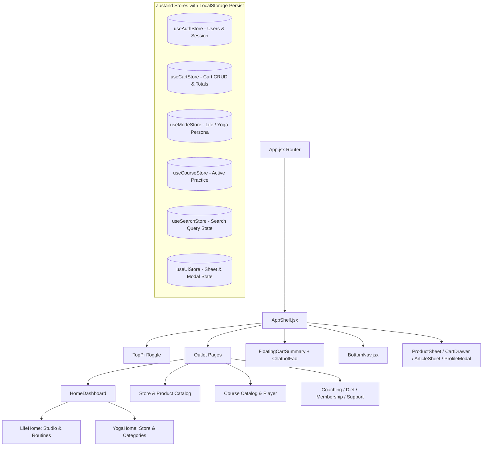

# 🕉️ Aathi Yoga & Aathi Life (ஆதி யோகா)
> **Dual-Experience Holistic Wellness Platform:** Sacred Lifestyle Store & Interactive Classical Yoga Studio

[](https://react.dev/)
[](https://vitejs.dev/)
[](https://www.framer.com/motion/)
[](https://github.com/pmndrs/zustand)
[](https://reactrouter.com/)
[](LICENSE)

---

## 📑 Table of Contents
- [Executive Overview](#-executive-overview)
- [System Architecture & State Flow](#-system-architecture--state-flow)
- [Key Features & Subsystems](#-key-features--subsystems)
  - [1. Animated Authentication & JSON Datastore](#1-animated-authentication--json-datastore)
  - [2. Dual-Mode Persona Morphing (`aathi:life` ↔ `aathi:yoga`)](#2-dual-mode-persona-morphing-aathilife--aathiyoga)
  - [3. Sacred Lifestyle E-Commerce Storefront](#3-sacred-lifestyle-e-commerce-storefront)
  - [4. Real-Time Cart CRUD & Financial Computation](#4-real-time-cart-crud--financial-computation)
  - [5. Interactive Guided Yoga Practice Player](#5-interactive-guided-yoga-practice-player)
  - [6. AI Assistant Chatbot with Support Routing](#6-ai-assistant-chatbot-with-support-routing)
  - [7. Holistic Subsystems (Coaching, Diet Plans, Memberships)](#7-holistic-subsystems-coaching-diet-plans-memberships)
- [Design System & Motion Physics](#-design-system--motion-physics)
- [Project Directory Structure](#-project-directory-structure)
- [Getting Started & Development](#-getting-started--development)
- [Testing & Quality Assurance](#-testing--quality-assurance)

---

## 🌟 Executive Overview

**Aathi Yoga & Life** is an Indian holistic wellness web application designed to bridge traditional wisdom with modern digital experiences. The platform allows users to seamlessly transition between **mindful product shopping** (sacred rudraksha, japa malas, yoga mats, crystal bracelets, metal god idols) and **active yoga & meditation practice** (timed asana sequences, guided postures, personalized diet plans, and 1-on-1 coaching) within a single, unified, responsive ecosystem.

### Core Highlights
* **Zero-Database Overhead:** Full authentication and persistent user management implemented using a lightweight, normalized JSON datastore synchronized with browser `localStorage`.
* **Dynamic Same-Route Persona Morphing:** Instant transition between e-commerce mode (`aathi:life`) and studio mode (`aathi:yoga`) without reloading or dropping state.
* **Authentic Visual Assets:** Curated high-resolution imagery and fallback vector glyphs across all 9 product categories and posture guides.
* **Interactive Studio Player:** Circular animated SVG timers, audio feedback, 3-step posture breakdowns (action, breathing, safety cues), calorie calculations, and streak trackers.

---

## 🏗️ System Architecture & State Flow



### State Store Architecture
* **`useAuthStore`:** Manages normalized user database, active logged-in user, registration validation, duplicate email/phone prevention, and session persistence.
* **`useCartStore`:** Handles shopping cart items, quantities, subtotal calculations, drawer visibility, and simulated checkout flow.
* **`useModeStore`:** Controls current active mode (`life` vs `yoga`) and triggers smooth visual transitions.
* **`useCourseStore`:** Tracks user course progress, completed sessions, calories burned, and practice streaks.
* **`useUiStore`:** Controls active slide-over sheets, modals, and global notification banners.

---

## 🚀 Key Features & Subsystems

### 1. Animated Authentication & JSON Datastore
* **Logo Splash Sequence:** Dynamic SVG lotus logo pulse on boot with graceful exit transitions.
* **Framer-Motion Form Switcher:** Smooth spatial transitions between Login and Register tabs.
* **Quick Demo Account Selector:** Pre-seeded with realistic accounts (`Aarav Sharma`, `Pooja Patel`, `Rahul Verma`) for rapid evaluator testing.
* **OTP Simulation:** 4-digit OTP input with automated focus shifting, resend countdown, and instant validation against user mobile numbers.
* **JSON State Architecture:** All user data is seeded from [`src/data/users.json`](src/data/users.json) and managed via Zustand's `persist` middleware in `localStorage`, maintaining registration state across browser reloads without external server dependencies.

### 2. Dual-Mode Persona Morphing (`aathi:life` ↔ `aathi:yoga`)
* **Unified Top Pill Switcher:** A high-contrast pill switch in the header allows instantaneous mode toggling.
* **Dynamic Persona Shift:**
  - `aathi:yoga`: Lifestyle marketplace with warm earthy tones, categories, trending collections, and spiritual wellness articles.
  - `aathi:life`: Studio dashboard featuring daily practice streaks, beginner/intermediate/advanced sequences, breathing sanctuary, and 1-on-1 coach booking.
* **Persistent Shared State:** The shopping cart, active user session, search queries, and practice progress remain synchronized regardless of mode switches.

### 3. Sacred Lifestyle E-Commerce Storefront
* **9 Curated Categories:**
  1. **Bracelets** (Sphatik crystal, Tiger Eye, Navratna)
  2. **Mala** (Sandalwood 108 Japa, Sphatik Crystal, Lotus Seed)
  3. **Rings** (Panchdhatu Navgrah, Om Engraved Silver, Rudraksha Band)
  4. **Rudraksha Bracelets** (2-Mukhi, Karungali Silver, Amethyst Combo)
  5. **Yoga Mats** (Classic 6mm Grip, Natural Cork Pro, TravelLite Foldable)
  6. **Accessories** (Brass Puja Thali, Sandalwood Incense, Mat Bags)
  7. **Metal God Idols** (Hand-cast Brass Ganesha, Panchdhatu Lakshmi, Silver Krishna)
  8. **Pendants** (Silver Om, 1-Mukhi Rudraksha Locket, Sri Yantra)
  9. **Tulasi Mala** (Classic Kanti, Double Layer, Silver Capped)
* **Micro-Interactions:** Hover scale-up, price tag elevation, stock scarcity badges, and comprehensive bottom-sheet product quick-views.

### 4. Real-Time Cart CRUD & Financial Computation
* **Complete CRUD Capabilities:**
  - **Create:** One-tap add to cart from product cards or product detail sheets.
  - **Read:** Live item breakdown in both the slide-out `CartDrawer` and full `/cart` page.
  - **Update:** Instant quantity increment/decrement with auto-removal on zero.
  - **Delete:** Single-item removal with confirmation micro-animations and cart wipe.
* **Dynamic Pricing Engine:** Calculates Subtotal, 5% GST tax, delivery charges (free on orders $\ge$ ₹1,500), and final payable amount in real time.
* **Floating Cart Summary Bar:** Persistent bottom indicator showing item count, total price, and one-click checkout drawer access.

### 5. Interactive Guided Yoga Practice Player
* **Difficulty Filters:** Beginner (12–15 min), Intermediate (20–25 min), and Advanced (30–35 min).
* **Live Circular Countdown Timer:** SVG-driven circular progress bar animating remaining pose duration with smooth countdown intervals.
* **Player Controls:** Play, Pause, Resume, Reset, and Next Pose navigation buttons.
* **3-Step Asana Guidance:** Each pose offers granular step-by-step cues for:
  - **Position & Posture:** Detailed alignment instructions.
  - **Breathing Rhythm:** Inhale/exhale cadence and diaphragmatic pacing.
  - **Safety & Contraindications:** Preventing strain and adjusting for injuries.
* **Completion Summary:** Post-workout metrics screen showing total practice time, calories burned, streak celebration, and recommendation for the next logical sequence.

### 6. AI Assistant Chatbot with Support Routing
* **Floating Action Button (FAB):** Ambient breathing halo animation positioned in the bottom-right corner.
* **Conversational Intelligence:** Natural keyword parsing engine covering courses, memberships, products, pricing, diet plans, and coaching.
* **Natural UX:** Realistic thinking delay, word-by-word streaming effect, and quick suggestion chips.
* **Smart Support Fallback:** If a query falls outside the automated knowledge base, the bot presents a direct `Talk to Support` escalation button routing directly to the `/support` hotline.

### 7. Holistic Subsystems (Coaching, Diet Plans, Memberships)
* **Personal Coaching Booking:** View profiles of master yoga instructors (Hatha, Ashtanga, Vinyasa), experience ratings, and book dedicated 1-on-1 time slots.
* **Personalized Diet Plans:** 6 comprehensive dietary regimens (Weight Loss, Weight Gain, General Wellness, Sattvic/Vegetarian, High Protein, Senior Citizen) with complete daily meal guides and caloric targets.
* **Tiered Memberships:** Monthly (₹999), Quarterly (₹2,499 - Most Popular), and Yearly (₹8,999 - Best Value) with detailed entitlement breakdowns.
* **Meditation Sanctuary:** Guided breathing visualizer with an organic expanding/contracting breath circle.

---

## 🎨 Design System & Motion Physics

* **Primary Palette:**
  - Terracotta / Saffron: `#d9653b` (warmth, spirituality, grounding)
  - Jade / Teal: `#0f766e` (vitality, breath, calmness)
  - Deep Slate: `#0f172a` (contrast, structure, clarity)
  - Amber Gold: `#f59e0b` (highlights, badges, ratings)
* **Motion Choreography (Framer Motion):**
  - Spring Press: `type: 'spring', stiffness: 400, damping: 25`
  - Modal Slide: `type: 'spring', stiffness: 320, damping: 30`
  - Persona Cross-Fade: Duration 350ms with ease curves (`cubic-bezier(0.16, 1, 0.3, 1)`)
  - Reduced Motion Guard: Full compliance with `prefers-reduced-motion` media queries.

---

## 📂 Project Directory Structure

```
aathi-yoga/
├── public/                                 # Static Assets
│   ├── assets/                             # Product images, yoga pose webps, coach photos
│   ├── favicon.svg                         # Aathi Yoga lotus favicon
│   └── icons.svg                           # SVG symbol sprite
├── src/
│   ├── assets/                             # Internal vector & product asset data
│   │   └── products/
│   │       └── aathilife-products.json     # Curated product catalog metadata
│   ├── components/                         # Reusable UI Primitives
│   │   ├── layout/                         # AppShell, TopPillToggle, BottomNav, PageHeader
│   │   ├── ui/                             # Buttons, BottomSheets, PriceTags, Toasts, Confetti
│   │   ├── icons/                          # PoseIllustration, CategoryIcon
│   │   ├── ArticleSheet.jsx                # Lifestyle wellness article modal
│   │   ├── CartDrawer.jsx                  # Slide-over interactive shopping cart
│   │   ├── ChatbotFab.jsx                  # Floating AI Assistant & NLP handler
│   │   ├── FloatingCartSummary.jsx         # Bottom floating cart summary pill
│   │   ├── ProductCard.jsx                 # Spring-hover animated product card
│   │   ├── ProductGallery.jsx              # Multi-photo product image switcher
│   │   ├── ProductImage.jsx                # Image loader with graceful glyph fallback
│   │   └── ProductSheet.jsx                # Quick-view bottom sheet for products
│   ├── data/                               # Seed Datastores & Business Logic
│   │   ├── articles.js                     # Holistic wellness article content
│   │   ├── chatbotRules.js                 # Rule-based NLP matching dictionary
│   │   ├── coaches.js                      # Yoga guru profiles & available slots
│   │   ├── courses.js                      # Asanas, step breakdowns & courses
│   │   ├── dietPlans.js                    # 6 custom dietary meal guides
│   │   ├── meditation.js                   # Meditation session configurations
│   │   ├── membership.js                   # Subscription tiers & entitlements
│   │   ├── products.js                     # 9 categories & product definitions
│   │   ├── users.js                        # User utility helpers & normalizers
│   │   └── users.json                      # Seed JSON database for demo users
│   ├── hooks/                              # Custom React Hooks
│   │   ├── useAddToCartSequence.js         # Cart interaction choreography
│   │   ├── useInViewOnce.js                # Viewport entry triggers
│   │   └── useScrollActivity.js            # Scroll state management
│   ├── lib/                                # Pure Utility Functions & Physics
│   │   ├── formatTime.js                   # Time & session formatting helpers
│   │   ├── motion.js                       # Reusable Framer Motion physics constants
│   │   ├── otpService.js                   # Simulated OTP validation engine
│   │   └── validators.js                   # Form validation rules
│   ├── pages/                              # Routed Screen Controllers
│   │   ├── auth/                           # Login & Signup tabbed modal
│   │   ├── cart/                           # Full Cart & Simulated Checkout
│   │   ├── coaching/                       # 1-on-1 Personal Coach Booking
│   │   ├── courses/                        # Catalog, CoursePlayer & SessionComplete
│   │   ├── diet/                           # Personalized Diet Plans
│   │   ├── home/                           # HomeDashboard, LifeHome & YogaHome
│   │   ├── life/                           # Meditation Sanctuary
│   │   ├── membership/                     # Subscription tier selection
│   │   ├── store/                          # Category Index, Products & Details
│   │   ├── support/                        # Hotline, Email & FAQ support desk
│   │   ├── OtpVerification.jsx             # 4-digit simulated OTP verification
│   │   └── SplashScreen.jsx                # Initial brand logo splash screen
│   ├── store/                              # Zustand State Stores
│   │   ├── useAuthStore.js                 # Authentication & JSON user store
│   │   ├── useCartStore.js                 # Cart CRUD & total calculation
│   │   ├── useCourseStore.js               # Practice progress & streak tracking
│   │   ├── useModeStore.js                 # Dual-mode (life / yoga) state
│   │   ├── useSearchStore.js               # Search query state
│   │   └── useUiStore.js                   # Global modal & drawer triggers
│   ├── App.jsx                             # Root Route Configuration & Animated Transitions
│   ├── index.css                           # CSS custom property tokens & reset
│   └── main.jsx                            # Application entry point
├── eslint.config.js                        # ESLint configuration
├── index.html                              # HTML entry point with meta tags
├── package.json                            # Project dependencies & npm scripts
└── vite.config.js                          # Vite build & test configuration
```

---

## 💻 Getting Started & Development

### Prerequisites
* **Node.js:** v18.0.0 or higher
* **Package Manager:** `npm` (v9+) or `pnpm`

### Installation & Execution

1. **Clone & Navigate:**
   ```bash
   git clone https://github.com/your-username/aathi-yoga.git
   cd aathi-yoga
   ```

2. **Install Dependencies:**
   ```bash
   npm install
   ```

3. **Start Development Server:**
   ```bash
   npm run dev
   ```
   Open [http://localhost:5173](http://localhost:5173) in your browser.

4. **Production Build & Preview:**
   ```bash
   npm run build
   npm run preview
   ```

---

## 🧪 Testing & Quality Assurance

* **Run Linter:**
  ```bash
  npm run lint
  ```
* **Run Unit & Component Tests:**
  ```bash
  npm run test
  ```

---

*Crafted with reverence for classical wellness & modern engineering excellence.*
